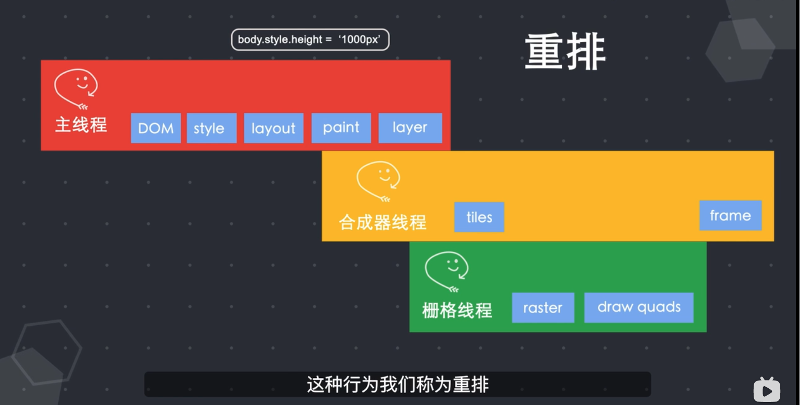

# 渲染页面过程

- 渲染器进程：核心任务就是把 `html`、`css`、`js`、`image` 等渲染成用户可交互的web页面
- 主线程：DOM => style => layout（布局） => paint（绘制） => layer（图层）
- 合成器线程：图层切分快 和 合成器帧发送
- 栅格线程：图块栅格化，图块的信息

## 浏览器的进程与线程

[浏览器的进程与线程](https://juejin.cn/post/6991849728493256741)

### Chrome 打开一个页面有多少进程

浏览器从关闭到启动，然后新开一个页面至少需要：

`1个浏览器进程`，`1个GPU进程`，`1个网络进程`，和`1个渲染进程`，一共4个进程；

后续如果再打开新的标签页：

- 浏览器进程，GPU进程，网络进程是共享的，不会重新启动，然后默认情况下会为每一个标签页配置一个渲染进程；

- 但是也有例外，比如从A页面里面打开一个新的页面B页面，而A页面和B页面又属于同一站点的话，A和B就共用一个渲染进程，其他情况就为B创建一个新的渲染进程

最新的Chrome浏览器包括：`1个浏览器主进程`，`1个GPU进程`，`1个网络进程`，`多个渲染进程`，和`多个插件进程`

- `浏览器进程`： 负责控制浏览器除标签页外的界面，包括地址栏、书签、前进后退按钮等，以及负责与其他进程的协调工作，同时提供存储功能
- `GPU进程`：负责整个浏览器界面的渲染。Chrome刚开始发布的时候是没有GPU进程的，而使用GPU的初衷是为了实现3D
  CSS效果，只是后面网页、Chrome的UI界面都用GPU来绘制，这使GPU成为浏览器普遍的需求，最后Chrome在多进程架构上也引入了GPU进程
- `网络进程`：负责发起和接受网络请求，以前是作为模块运行在浏览器进程一时在面的，后面才独立出来，成为一个单独的进程
- `插件进程`：主要是负责插件的运行，因为插件可能崩溃，所以需要通过插件进程来隔离，以保证插件崩溃也不会对浏览器和页面造成影响
- `渲染进程`：负责控制显示tab标签页内的所有内容，核心任务是将HTML、CSS、JS转为用户可以与之交互的网页，排版引擎Blink和JS引擎V8都是运行在该进程中，默认情况下Chrome会为每个Tab标签页创建一个渲染进程

### 渲染进程中的线程

- `GUI渲染线程`：负责渲染页面，解析html和CSS、构建DOM树、CSSOM树、渲染树、和绘制页面，重绘重排也是在该线程执行
- `JS引擎线程`：一个tab页中只有一个JS引擎线程(单线程)，负责解析和执行JS。它GUI渲染进程不能同时执行，只能一个一个来，如果JS执行过长就会导致阻塞掉帧
- `计时器线程`：指setInterval和setTimeout，因为JS引擎是单线程的，所以如果处于阻塞状态，那么计时器就会不准了，所以需要单独的线程来负责计时器工作
- `异步http请求线程`： XMLHttpRequest连接后浏览器开的一个线程，比如请求有回调函数，异步线程就会将回调函数加入事件队列，等待JS引擎空闲执行
- `事件触发线程`：主要用来控制事件循环，比如JS执行遇到计时器，AJAX异步请求等，就会将对应任务添加到事件触发线程中，在对应事件符合触发条件触发时，就把事件添加到待处理队列的队尾，等JS引擎处理

## 渲染页面

1. 解析 html（DOM Tree）`主线程`
    1. 解析 html 异步解析
    2. 通过词法分析，将 `html` 解析多个标记
    3. 根据标记，进行 `DOM Tree` 构造
    4. 构造过程中创建 `document` 对象
    5. 以 `document` 为根节点 `DOM Tree`，不断进行修改，向其中添加各种元素，创建 `DOM Tree`

2. 解析 css （style Tree）`主线程`
    1. 解析 css，并确定 DOM 节点的计算样式
    2. 如果没有就用浏览器默认的 css
    3. 生成 `style Tree`
    4. 如果 link 会将引入的css 全部解析完成 同步解析

3. 创建 layout 布局 （layout Tree）`主线程`
    1. 主线程根据 DOM Tree 和 style Tree 来创建 layout Tree
    2. layout Tree 每个节点会记录 x y 坐标和边框大小等
    3. DOM Tree 和 layout Tree 不是一一对应的
        1. DOM Tree 设置了 display：none 的，layout 不会显示
        2. 在 css 伪类中添加了 content 内容的元素，content的内容 不会出现在 DOM Tree 上
        3. 伪类 是通过 css 解析的不会出现在的 dom 上

4. 创建绘制表（paint）`主线程`
    1. 根据 layout 创建绘制记录表
    2. 确定绘制顺序，z-inde 这些

5. 生成 layer Tree（图层）`主线程`
    1. 根据 layout Tree 生成 layer Tree（图层）
    2. 并把 layout Tree 和 layer Tree 传递给合成器线程（通过IPC传递）

6. 分图层和切块 `合成器线程`
    1. 合成器线程将图层切分为图块
    2. 将图块发送诶栅格线程

7. 栅格化  `栅格线程`
    1. 对图块进行栅格化，
    2. 产生图块信息
    3. 并把图块信息传递给合成器

8. 渲染
    1. 合成器进程收到栅格线程的图块信息，
    2. 根据信息合成器线程合成一个合成器帧
    3. 通过 IPC 将合成器帧 传递得浏览器进程
    4. 浏览器进程再传到 CPU 进行渲染

## 重排和重绘问题

- 重排：当修改元素尺寸和位置时，会触发样式计算（style）、布局（layout）、绘制（paint）以及后面所有流程
- 重绘：当修改元素的颜色时，会触发样式计算（style）以及绘制（paint）

反复做的重排和重绘会导致掉帧卡顿，重排和重绘都会占用主线程，JS会执行会阻塞主线程

触发回流的操作：

- 添加或删除可见的DOM元素
- 元素的位置发生变化
- 元素的尺寸发生变化
- 浏览器的窗口尺寸变化

重绘是只重新像素绘制，当元素样式的改变不影响布局时触发。

回流=计算样式+布局+分层+绘制；重绘=绘制。故回流对性能的影响更大

所以应该尽量避免回流和重绘。比如利用GPU加速来实现样式修改，`transform / opacity / filters`这些属性的修改都不是在主线程完成的，不会重绘，更不会回流。

### 重排

### 重绘

## 优化

### requestAnimationFrame()

> window.requestAnimationFrame() 告诉浏览器——你希望执行一个动画，
> 并且要求浏览器在 **下次重绘之前调用** 指定的回调函数更新动画。
> 该方法需要传入一个回调函数作为参数，该回调函数会在浏览器 **下一次重绘之前** 执行

- 方法在**每一帧之前调**用告诉浏览器——你希望执行一个动画，并且要求浏览器在下次**重绘之前**调用指定的回调函数更新动画
- 把 js 任务 分成更小的任务块
- 在每一帧完成前暂停js 执行归还主线程
- 下一帧开始时主线程就可以按时执行布局和绘制
- react 最新的渲染引擎，react Filer用这个api 做了很多优化
- 中断（Generator）和 异步的思想

### transform

- 该属性实现动画不会经过布局和绘制（不会占用主线程）
- 会运行在 `合成器线程` 和 `栅格线程` 中，不受主线程的js执行的影响
- transform 实现动画不需要经过布局（layout）、绘制（paint）样式计算等操作节省了运算时间

## 阻塞渲染的

- css 阻塞
    1. style标签：
        - 由 html 解析器解析（异步）
        - 边加载边渲染
        - 不阻塞浏览器渲染
        - 不阻塞 DOM 解析
        - 异步解析的，分组解析渲染，容易出现闪屏现象
    2. link 引入css：（推荐使用）
        - 由 css 解析器进行解析 (同步)
        - 解析完成后
        - 不阻塞 DOM 解析
        - 阻塞浏览器渲染
        - 阻塞 script 标签中 js 执行
        - 解析 css 样式，只解析一次，是同步的，等所有的 css 全部加载完再解析
    3. style：内联
        1. 一进页面，就看见了盒子，这个盒子背景颜色 赤橙红绿青蓝紫 闪一遍，最终颜色是紫色 （过程都看出来）
    4. link：外链
        1. 进页面先空白，因为这个时候在请求资源、解析，等着 Stylesheet 解析完了，统一渲染，盒子出来，背景颜色是紫色
- JS 阻塞
    1. 阻塞后续DOM解析
    2. 阻塞渲染
    3. 阻塞后续JS执行
    4. 图片需要通过网络下载或从缓存中直接加载不会阻塞 html 解析，因为他们不会影响 dom 的生成

## 阻塞优化

- css 优化：
    1. 首屏页面 css 独立出来，放到 style 里面內联加载，加载html的时候同时加载
    2. 使用 cdn 节点进行外部资源加速
    3. 对 css 进行压缩，比如使用（webpack、gulp等）
    4. 减少 http 资源请求次数，多个 css 文件合并
    5. 优化样式表的代码
    6. [style 样式渲染](https://blog.csdn.net/Luckyzhoufangbing/article/details/108548783)

- JS 优化：在页面的最下面引入 js，或者使用 defer 属性，这样页面在渲染会在渲染完成后加载
    - async：异步加载，下载过程中不会影响到 html 的解析，但是下载完成后会立即执行，对堵塞 html 解析
    - defer：异步加载，下载过程中不会影响到 html 的解析，会在所有的元素解析完成后，DOMContentLoaded 事件之前触发完成

- 参考
- [浏览器渲染机制](https://segmentfault.com/a/1190000022084293)

## async、defer、preload、prefetch有什么区别

### async和defer有什么差别

- 没有 defer 或 async，浏览器会立即加载并执行指定的脚本
- async 属性表示异步执行引入的 JavaScript，经加载好，就会开始执行
- defer 属性表示延迟到DOM解析完成，，DOMContentLoaded 事件之前触发完后再执行引入的 JS

### preload、prefetch有什么区别

- preload：以高优先级为当前页面加载资源；
- prefetch：以低优先级为后面的页面加载未来需要的资源，只会在空闲时才去加载；

无论是preload还是prefetch，都只会加载，不会执行，
如果预加载的资源被服务器设置了可以缓存cache-control那么会进入磁盘，反之只会被保存在内存中。

