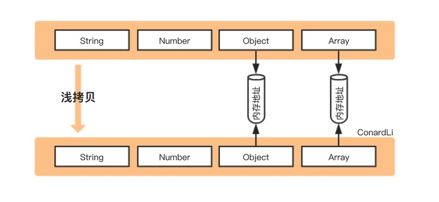

# 深浅拷贝

## 浅拷贝与深拷贝

- **浅拷贝** 是创建一个新的对象，这个对象有这原始对象的值的一份精确的拷贝

    - 基本类型：拷贝的就是基本类型的值

    - 引用类型：拷贝的是内存的地址，也就是**栈内存**的对象的指针。如果一个对象改变了这个地址，就会影响其他对象

- **深拷贝** 将一个对象从内存中完成拷贝一份处理，从堆内存中开辟一个新的区域存放新对象，
  且**修改新对象不会影响原来的对象**

```javascript
var a1 = { b: { c: {} } }

var a2 = shallowClone(a1)   // 浅拷贝方法

a2.b.c === a1.b.c           // true 新旧对象还是共享同一块内存

var a3 = deepClone(a3)      // 深拷贝方法

a3.b.c === a1.b.c           // false 新对象跟原对象不共享内存
```

借助大佬的图

**浅拷贝**


**深拷贝：**


## 浅拷贝实现

### Object.assign

```javascript
let obj1 = { a: 'a' }

let obj2 = { b: 'b' }

let obj = Object.assign({}, obj1, obj2)
```

### 扩展运算符

与 `Object.assign` 功能类型

```javascript
let obj1 = { name: 'Kobe', address: { x: 100, y: 100 } }

let obj2 = { ...obj1 }

obj1.address.x = 200

obj1.name = 'wade'

console.log('obj2', obj2) // obj2 { name: 'Kobe', address: { x: 200, y: 100 } }
```

### Array.prototype.concat

```javascript
let arr = [1, 3, {
  username: 'kobe'
}]

let arr2 = arr.concat()

arr2[2].username = 'wade'

console.log(arr) // [ 1, 3, { username: 'wade' } ]
```

### Array.prototype.slice

```javascript
let arr = [1, 3, {
  username: 'kobe'
}]

let arr3 = arr.slice()

arr3[2].username = 'wade'

console.log(arr) // [ 1, 3, { username: 'wade' } ]
```

## 深拷贝实现

### JSON.parse(JSON.stringify())

这种方法不能处理函数和正则，函数处理后变成 null，正则处理后变成空对象

### 考察点：

1. 基本实现
    - 递归能力
    - 循环引用（循环导致内存溢出）

2. 考虑问题的全面性
    - 理解weakmap的真正意义 (内存释放)
    - 多种类型

3. 考虑问题的严谨性
    - 创建各种引用类型的方法，JS API的熟练程度
    - 准确的判断数据类型，对数据类型的理解程度

4. 通用遍历
    - 写代码可以考虑性能优化
    - 了解集中遍历的效率
    - 代码抽象能力

5. 拷贝函数：
    - 箭头函数和普通函数的区别
    - 正则表达式熟练程度

- [如何写出一个惊艳面试官的深拷贝?](https://segmentfault.com/a/1190000020255831)

### 手写实现 深度拷贝

- **简单的写法**

::: details 简单的写法

```javascript
function deepClone(obj, hash = new WeakMap) {

  // 如果是不存在就不拷贝了
  if (obj === null) return obj

  // 时间格式处理
  if (obj instanceof Date) return new Date(obj)

  // 正则格式处理
  if (obj instanceof RegExp) return new RegExp(obj)

  // 如果对象是普通值的话就不需要拷贝
  if (typeof obj !== 'object') return obj

  // 是对象的话就要进行 深拷贝
  if (hash.get(obj)) return hash.get(obj)

  // 找到对象所属原型上的 constructor，而原型上的 constructor 指向的是当前类本身
  let cloneObj = new obj.constructor()

  hash.set(obj, cloneObj)

  for (let key in obj) {
    if (obj.hasOwnProperty(key)) {

      // 递归拷贝
      cloneObj[key] = deepClone(obj[key], hash)
    }
  }

  return cloneObj
}
```

:::

### 完整写法 参考大佬

- [如何写出一个惊艳面试官的深拷贝?](https://segmentfault.com/a/1190000020255831)

::: details 完整写法

 ```javascript
const mapTag = '[object Map]'
const setTag = '[object Set]'
const arrayTag = '[object Array]'
const objectTag = '[object Object]'
const argsTag = '[object Arguments]'

const boolTag = '[object Boolean]'
const dateTag = '[object Date]'
const numberTag = '[object Number]'
const stringTag = '[object String]'
const symbolTag = '[object Symbol]'
const errorTag = '[object Error]'
const regexpTag = '[object RegExp]'
const funcTag = '[object Function]'

const deepTag = [mapTag, setTag, arrayTag, objectTag, argsTag]

function forEach(array, iteratee) {
  let index = -1
  const length = array.length
  while (++index < length) {
    iteratee(array[index], index)
  }
  return array
}

function isObject(target) {
  const type = typeof target
  return target !== null && (type === 'object' || type === 'function')
}

function getType(target) {
  return Object.prototype.toString.call(target)
}

function getInit(target) {
  const Ctor = target.constructor
  return new Ctor()
}

function cloneSymbol(targe) {
  return Object(Symbol.prototype.valueOf.call(targe))
}

function cloneReg(targe) {
  const reFlags = /\w*$/
  const result = new targe.constructor(targe.source, reFlags.exec(targe))
  result.lastIndex = targe.lastIndex
  return result
}

function cloneFunction(func) {
  const bodyReg = /(?<={)(.|\n)+(?=})/m
  const paramReg = /(?<=\().+(?=\)\s+{)/
  const funcString = func.toString()
  if (func.prototype) {
    const param = paramReg.exec(funcString)
    const body = bodyReg.exec(funcString)
    if (body) {
      if (param) {
        const paramArr = param[0].split(',')
        return new Function(...paramArr, body[0])
      } else {
        return new Function(body[0])
      }
    } else {
      return null
    }
  } else {
    return eval(funcString)
  }
}

function cloneOtherType(targe, type) {
  const Ctor = targe.constructor
  switch (type) {
    case boolTag:
    case numberTag:
    case stringTag:
    case errorTag:
    case dateTag:
      return new Ctor(targe)
    case regexpTag:
      return cloneReg(targe)
    case symbolTag:
      return cloneSymbol(targe)
    case funcTag:
      return cloneFunction(targe)
    default:
      return null
  }
}

function clone(target, map = new WeakMap()) {

  // 克隆原始类型
  if (!isObject(target)) {
    return target
  }

  // 初始化
  const type = getType(target)
  let cloneTarget
  if (deepTag.includes(type)) {
    cloneTarget = getInit(target, type)
  } else {
    return cloneOtherType(target, type)
  }

  // 防止循环引用
  if (map.get(target)) {
    return target
  }
  map.set(target, cloneTarget)

  // 克隆set
  if (type === setTag) {
    target.forEach(value => {
      cloneTarget.add(clone(value))
    })
    return cloneTarget
  }

  // 克隆map
  if (type === mapTag) {
    target.forEach((value, key) => {
      cloneTarget.set(key, clone(value))
    })
    return cloneTarget
  }

  // 克隆对象和数组
  const keys = type === arrayTag ? undefined : Object.keys(target)
  forEach(keys || target, (value, key) => {
    if (keys) {
      key = value
    }
    cloneTarget[key] = clone(target[key], map)
  })

  return cloneTarget
}
```

:::

## 参考

- [如何写出一个惊艳面试官的深拷贝?](https://segmentfault.com/a/1190000020255831)


