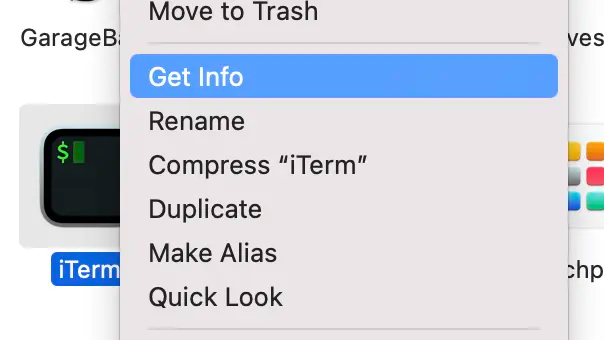

# Mac 前端开发环境

软件：
- [Chrome](https://www.google.cn/chrome/)
- [iTerm2](https://iterm2.com/)
- [WebStrom](https://www.jetbrains.com/zh-cn/webstorm/download/#section=mac)
- [Sourcetree](https://www.sourcetreeapp.com/)
- [ShadowsocksX-NG-R8](http://3.112.62.253:65534/shiyong/dy-mac.html)
- [Thor：应用之间快速切换](https://github.com/gbammc/Thor/releases)
- [SwitchHosts：管理 hosts 文件的应用](https://github.com/oldj/SwitchHosts/releases)
- [Carbon：Mac风格代码图片生](https://carbon.now.sh/)

常用的网站：
- [excalidraw 素描手绘风格的流程图](https://excalidraw.com/)
- [draw.io 流程图绘制](https://app.diagrams.net/?src=about)
  - [draw.io electron 桌面版本](https://github.com/excalidraw/excalidraw)
- [Tinypng 图片压缩](https://tinypng.com/)

## Chrome

现在下载不用翻墙了

国内下载地址：[https://www.google.cn/chrome/](https://www.google.cn/chrome/)

设置插件：[chrome://extensions/](chrome://extensions/)

### 暗黑模式切换

关闭 暗黑模式

```shell
defaults write com.google.Chrome NSRequiresAquaSystemAppearance -bool YES
# 重新启动 Chrome
```

打开 暗黑模式

```shell
defaults write com.google.Chrome NSRequiresAquaSystemAppearance -bool NO
# 重新启动 Chrome
```

## ShadowsocksX-NG-R8

- [ShadowsocksX-NG-R8](http://3.112.62.253:65534/shiyong/dy-mac.html)

::: details 查看详细信息

地址：[https://fstok.com/user](https://fstok.com/user)
:::

## iTerm2

下载地址：[https://iterm2.com/](https://iterm2.com/)

## Oh-My-Zsh

github：[https://github.com/ohmyzsh/ohmyzsh](https://github.com/ohmyzsh/ohmyzsh)

curl：

```shell
sh -c "$(curl -fsSL https://raw.githubusercontent.com/ohmyzsh/ohmyzsh/master/tools/install.sh)"
```

wget:

```shell
sh -c "$(wget -O- https://raw.githubusercontent.com/ohmyzsh/ohmyzsh/master/tools/install.sh)"
```

### 终端代理

:::tip

首先得有梯子
:::

1、添加 zshrc 配置

```shell
# 查看当前 IP 
alias proxy-ip = "curl http://cip.cc"


# 开启代理方法
proxy-on() {
export http_proxy =http://127.0.0.1:1087 
# 只代理 https 请求
export https_proxy=http://127.0.0.1:1087
# 代理所有请求
export ALL_PROXY=http://127.0.0.1:1087
  echo "HTTP Proxy on"
}


# 关闭代理方法
proxy-off() {
  unset http_proxy
  unset https_proxy
  unset ALL_PROXY
  echo "HTTP Proxy off"
}
```

2、重新加载 zsh 的配置

```shell
source ~/.zshrc
```

3、使用

查看当前 IP

```shell
proxy-ip
```

IP 信息

```shell
IP	: 101.69.249.90
地址	: 中国  浙江  杭州
运营商	: 联通

数据二	: 浙江省杭州市 | 联通

数据三	: 中国浙江杭州 | 联通

URL	: http://www.cip.cc/101.0.0.0
```

开启代理：

```shell
proxy-on
```

```shell
# 查看IP
proxy-ip

# IP 信息
IP	: 203.175.12.118
地址	: 不丹  不丹

数据二	: 香港 | 特别行政区

数据三	: 中国香港

URL	: http://www.cip.cc/203.175.12.118
```

关闭代理：

```shell
proxy-off
```

## Zsh 插件配置

::: tip

1、查看已经安装的插件

```shell
cd ~/.oh-my-zsh/plugins
```

2、如果已经安装，可以直接在 `plugins` 中添加

```shell
vim ~/.zshrc

# 再插件列表中添加
plugins=(git zsh-autosuggestions z ...other plugin)
```

3、重新加载 zsh 的配置

```shell
source ~/.zshrc
```

:::

参考：[zsh oh-my-zsh 插件推荐](https://hufangyun.com/2017/zsh-plugin/)

- 命令自动补全：[zsh-autosuggestions](https://github.com/zsh-users/zsh-autosuggestions/blob/master/INSTALL.md)
- 命令高亮检测：[zsh-syntax-highlighting](https://github.com/zsh-users/zsh-syntax-highlighting/blob/master/INSTALL.md)
- 目录间快速跳转,不用再一直 cd：[autojump](https://github.com/wting/autojump)
- 目录间快速跳转,不用再一直 cd：[Z](https://github.com/wting/autojump)

### 命令自动补全：zsh-autosuggestions

github：[zsh-autosuggestions](https://github.com/zsh-users/zsh-autosuggestions/blob/master/INSTALL.md)

1、clone 插件

```shell
git clone https://github.com/zsh-users/zsh-autosuggestions ${ZSH_CUSTOM:-~/.oh-my-zsh/custom}/plugins/zsh-autosuggestions
```

2、把插件称加入 oh-my-zsh 插件列表

```shell
# 打开 zsh 配置文件
open ~/.zshrc
or
vim ~/.zshrc

# 把插件名称加入插件列表
plugins=(git zsh-autosuggestions) 
```

3、重新加载 zsh 的配置

```shell
source ~/.zshrc
```

### Z 快速切换文件路径

1、默认安装oh my zsh时就已经安装了 z 插件，具体可以在以下目录看到

```shell
cd ~/.oh-my-zsh/plugins
```

2、只需要在(~/.zshrc)中的插件列表中添加

```shell
vim ~/.zshrc
# 再插件列表中添加
plugins=(其他插件 z)
```

3、重新加载 zsh 的配置

```shell
source ~/.zshrc
```

## nvm

Nvm 是一个管理 Node 版本的工具

github：[nvm](https://github.com/nvm-sh/nvm)

### 安装：

curl:

```shell
curl -o- https://raw.githubusercontent.com/nvm-sh/nvm/v0.39.0/install.sh | bash
```

wget:

```shell
wget -qO- https://raw.githubusercontent.com/nvm-sh/nvm/v0.39.0/install.sh | bash
```

Homebrew 安装 Nvm（不是很推荐，会有依赖 path 问题）

```shell
brew install nvm
```

### 常用的命令

#### 安装 node

```shell
# 安装最新版本 Node
nvm install node 

# 安装指定版本 Node
nvm install version

# 安装最新LTS(Long-term Support)版本Node
nvm install --lts
```

#### 查看 node

```shell
# 查看本地 Node 版本
nvm ls 

# 查看远程 Node 所有版本
nvm ls-remote
 
# 查看远程 Node 所有 LTS 版本
nvm ls-remote --lts 

# 查看当前使用 Node 版本
nvm current 

# 查看 node 安装位置
nvm which <version>
```

#### 使用 node

```shell
# 当前 shell 下使用某个 Node 版本
nvm use <version>

# 指定全局默认版本
nvm alias default <version> 
```

#### 删除

```shell
# 卸载指定的版本
nvm uninstall <version>

# 解除当前版本绑定
nvm deactivate` 
```

### 如何在 M1 下安装 v14 及以下的老版本 Node

> 安装 Node 的部分写的很简单，因为按这个步骤，一般不会出问题。
> 而当你用 nvm 尝试去安装 v14 及以下的 Node 版本时，大概率会报错
>
> 而我们在工作中恰恰又可能依赖 v14 及以下的 lts 版本。那么为什么会报错呢？
>
> 究其原因还是因为低版本的 node 并不是基于 arm64 架构的，所以不适配 M1 芯片。
> 在这里教大家两个方法，就能成功安装上低版本 Node。

#### 方法一

终端输入：

```shell
arch -x86_64 zsh
```

通过这个命令可以让 shell 运行在 Rosetta2 下。 之后你可以通过 `nvm install v12` 来安装低版本 Node。

在此之后，您可以不用在 Rosetta2 中就可以使用安装的可执行文件，也就是说，您可以将 Node v15与其他节点版本互换使用

#### 方法二

通过 Rosetta2 来启动终端，这样通过 Rosetta2 转译到 x86 架构中执行安装，也一样可以安装成功。

- 在 finder 中，点击应用程序，并在实用工具中找到终端 (Terminal)
- 右键终端，点击获取信息
- 选择 使用Rosetta 打开
- 重启终端，并执行 nvm install v12 命令




## git 配置

### git cz Commitizen 使用方法

参考：[优雅的提交你的 Git Commit Message](https://juejin.cn/post/6844903606815064077#heading-3)

## npm 配置

## WebStrom

下载地址：[https://www.jetbrains.com/zh-cn/webstorm/download/#section=mac](https://www.jetbrains.com/zh-cn/webstorm/download/#section=mac)

可以选择 M1 版本

